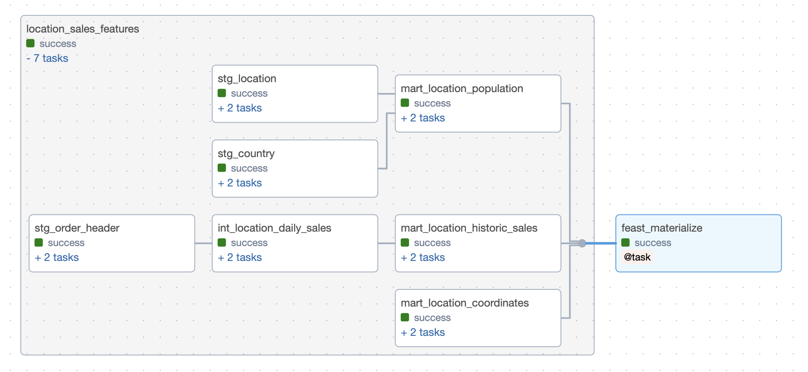

# Feast Demo

For this demo, we will be creating a feature engineering pipeline using the tasty bytes food truck dataset from Snowflake. The hypothetical initiative for these features is to train a ML model to direct food trucks to locations that are expected to have the highest sales for a given day. This use case was inspired from this [Snowflake quickstart](https://quickstarts.snowflake.com/guide/tasty_bytes_snowpark_101_for_data_science/#0). Features will be created using dbt and logged to Feast, a feature store. 

*This demo assumes you have docker desktop, because we are using astronomer to spin up airflow*

## Initial Setup/Config

#### Snowflake Setup
1. Create a demo [Snowflake account](https://www.snowflake.com/en/) with ACCOUNTADMIN access.
2. Enable Anaconda on the Snowflake account by going to <b>Admin</b> >> <b>Billing & Terms</b> >> <b>Anaconda</b> >> <b>Enable</b>.
3. Follow the [tasty bytes tutorial](https://quickstarts.snowflake.com/guide/tasty_bytes_introduction/index.html#0) from Snowflake to load the data we will be using into your Snowflake account.
4. In addition, follow step 3 in the [tasty bytes geospatial tutorial](https://quickstarts.snowflake.com/guide/tasty_bytes_zero_to_snowflake_geospatial/#2) to load the location coordinates data we'll also be using into the same Snowflake account.

#### Environment Setup

5. Run the following commands to set up a virtual environment:
- <code>conda create --name feast_on_snowflake --override-channels -c https://repo.anaconda.com/pkgs/snowflake python=3.10 numpy pandas</code>
- <code>conda activate feast_on_snowflake</code>
- <code>pip install 'feast[snowflake, redis]'== 0.33.1 dbt-snowflake==1.6</code>
6. Add the following variables to your environment for Feast to connect to Snowflake as your offline store. Replace the bracketed variables with your demo Snowflake account variables. 
    ```
    export SNOWFLAKE_DEPLOYMENT_URL=[YOUR DEPLOYMENT]
    export SNOWFLAKE_USER=[YOUR USER]
    export SNOWFLAKE_PASSWORD=[YOUR PASSWORD]
    export SNOWFLAKE_ROLE=ACCOUNTADMIN
    export SNOWFLAKE_WAREHOUSE=COMPUTE_WH
    ```

#### Feast Setup

A Feast repo can be created using the command `feast init tasty_bytes_feature_store -t snowflake`. You will not have to do this because a Feast repo has already been created inside the feature_store folder.

#### Airflow Setup
An Astro project can be created using the command `astro dev init`. You will not have to do this because an Astro project already exists inside the airflow folder.

7. Install the [Astro CLI](https://docs.astronomer.io/astro/cli/install-cli?tab=mac#install-the-astro-cli).
8. Add the following variables inside the airflow/.env file:
    ```
    AIRFLOW_VAR_SNOWFLAKE_DEPLOYMENT_URL=[YOUR DEPLOYMENT]
    AIRFLOW_VAR_SNOWFLAKE_SCHEMA=ANALYTICS
    AIRFLOW_VAR_SNOWFLAKE_USER=[YOUR USER]
    AIRFLOW_VAR_SNOWFLAKE_PASSWORD=[YOUR PASSWORD]
    AIRFLOW_VAR_SNOWFLAKE_ROLE=ACCOUNTADMIN
    AIRFLOW_VAR_SNOWFLAKE_WAREHOUSE=COMPUTE_WH
    AIRFLOW_VAR_SNOWFLAKE_DATABASE=FROSTBYTE_TASTY_BYTES
    ``` 


#### dbt Setup
We will be using the [dbt-cosmos](https://github.com/astronomer/astronomer-cosmos) package to run our dbt project with Airflow. The cosmos package takes your dbt Core project and splits each model as an Airflow task, with the entire project encompassed in a task group.

For cosmos to work with Astronomer, a dbt folder was created under airflow/dags/ and a dbt project was created under that folder.

9. Even though a dbt project already exists in the path `airflow/dags/dbt/dbt_tasty_bytes`, we will still run the command `dbt init` inside the dbt_tasty_bytes folder to set up your connection profile to Snowflake on your local profiles.yml file. An example of filling out the fields prompted by the dbt cli:
    ```
    Which database would you like to use?
    [1] snowflake
    Enter a number: 1
    account (https://<this_value>.snowflakecomputing.com): [YOUR DEPLOYMENT]
    user (dev username): [YOUR USER]
    [1] password
    [2] keypair
    [3] sso
    Desired authentication type option (enter a number): 1
    password (dev password): [YOUR PASSWORD]
    role (dev role): ACCOUNTADMIN
    warehouse (warehouse name): COMPUTE_WH
    database (default database that dbt will build objects in): FROSTBYTE_TASTY_BYTES
    schema (default schema that dbt will build objects in): ANALYTICS
    threads (1 or more) [1]: 1
    ```


## Fun Part

Setup is commonly the most grueling part of tutorials, and this one didn't even try to break boundaries; now onto the fun part >>> understanding what's all happening in the repo and making everything work 🦙.

Big picture, we are going to:
- Use dbt to transform the raw food truck data we loaded into Snowflake into features that we might use later down the road to predict sales based on location.
- Register the features created in Snowflake, by dbt, into our feature store, Feast.
- Orchestrate the process of running the dbt project on a (your) desired cadence and having the new calculated features materialized into Feast using Airflow to create a feature engineering pipeline.

#### Creating our data models in Snowflake

The dbt_tasty_bytes project creates three final data models, all with different features for locations. 
- `mart_location_coordinates`:

    | location_id | longitude | latitude | timestamp |
    | -- | -- | -- | -- |


- `mart_location_population`:

    | location_id | city_population | timestamp | 
    | -- | -- | -- |

- `mart_historic_sales`:

    | location_id | business_date | month | day_of_week | daily_sales | avg_previous_day_sales | avg_l10_day_sales | timestamp |
    | -- | -- | -- | -- | -- | -- | -- | -- |

All of the data models have the `location_id` column so that Feast will know which column (entity) to join on. They all also have the `timestamp` column because Feast requires an event timestamp, the timestamp an event occurred, so that during feature retrieval, Feast returns accurate features using point-in-time joins.


10. Inside the dbt_tasty_bytes folder, run `dbt run`. This will run our dbt project for the first time and create the database tables that Feast will use for its source data.

#### Creating our feature store

For this local Feast demo, we will be using our Snowflake account as the offline store and a Redis server as the online store for low-latency feature retrieval use cases.

There are four main objects in the Feast python sdk you should know for our example: data sources, entities, feature views, and feature services. 

In the feature_store/feature_repo folder, each of these objects have been broken out into its own python file. 
- The Snowflake <b>source tables</b> are defined in data_sources.py. A new source is created for each Snowflake table.
- The <b>entities</b>, domain object(s) that have features, and their join keys are defined in entities.py. In this example, the entity is location and the join key is `location_id`.
    - *The join key tells Feast how to join features together. Currently (9/5/2023), Feast does not yet support multi-column join keys* 
- The <b>feature views</b> are defined in features.py. A feature view is essentially a view ontop of a data source where you specify the entity the view is for and the columns in the data source Feast should pay attention to as features.
- The <b>feature services</b> are defined in feature_services.py. A feature service is a combination of feature views that have the same entity. ML Models will read from a feature service. This additional layer in Feast's architecture allows feature views to be reusable in multiple feature services.


11. Once inside the /feature_repo folder, run `feast apply`. This will scan all of the python files for the feature we've defined and deploy all the infrastructure needed in your offline feature store (Snowflake).
12. We're now going to create our airflow pipeline, but before that, in the /feature_store folder, run the command:
    `docker-compose -f docker-compose-feast.yml up` 
    - This will spin up a Redis server to act as our online store as well as a Postgres server to act as the a central catalog of all the feature definitions and their related metadata.

#### Orchestrating with Airflow

Our simplified airflow feature engineering pipeline has two simple but effective steps.
- First, run the dbt project dbt_task_group using cosmos.
- Last, materialize the newly calculated features values into Feast. Materialize means the new feature values will be updated in your offline store, Snowflake, which holds a history of feature values, and your online store, Redis, will be updated to only contain the newest feature values.

12. Spin up astronomer using `astro dev start` and trigger the location_sales_feature_engineering pipeline. 🤞 all tasks are green.

## Summary

Hopefully this tutorial was able to simplify/(make it seem less daunting) the process of using airflow orchestrate a feature engineering pipeline with dbt and Feast. 



13. Spin down astronomer using `astro dev kill` and spin down the feature store with Ctrl+C and then `docker-compose -f docker-compose-feast.yml down`